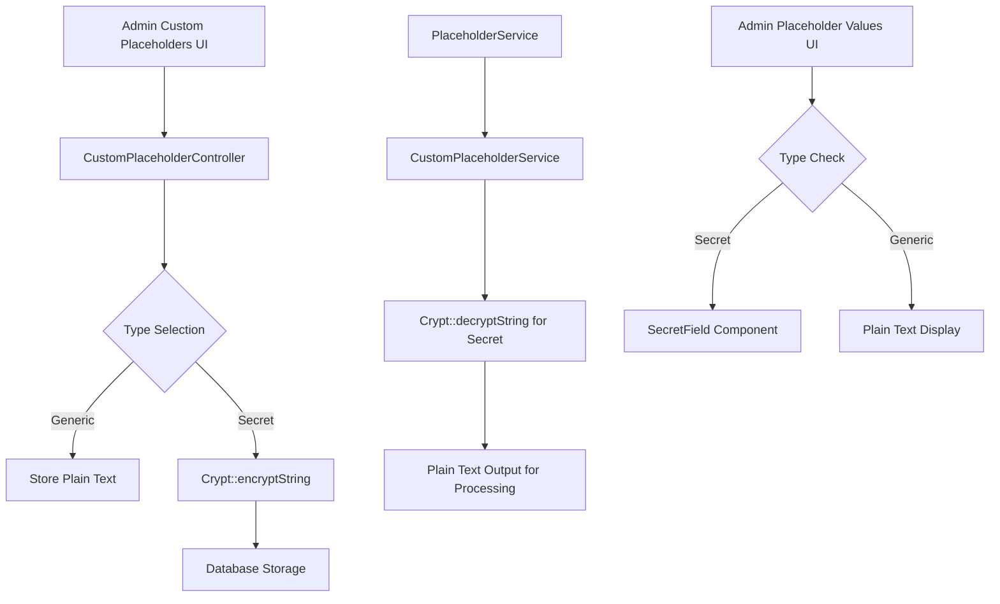

# Custom Placeholders Upgrade Plan

## Overview
Upgrade custom placeholders to support two types: **Generic** (text) and **Secret** (encrypted text). Secret placeholders will be:
- Displayed as masked input in frontend management UI
- Stored encrypted in database using Laravel's Crypt facade
- Decrypted only when accessed via the CustomPlaceholderService for processing

## Architecture Diagram



## Implementation Steps

### 1. Database Migration
**File:** `backend/database/migrations/2026_03_08_XXXXXX_add_type_and_encryption_to_custom_placeholders_table.php`

Add columns:
- `type` (enum: 'generic' | 'secret')
- `is_encrypted` (boolean)

### 2. CustomPlaceholder Model Update
**File:** [`backend/app/Models/CustomPlaceholder.php`](backend/app/Models/CustomPlaceholder.php:1)

Changes:
- Add `type` to fillable array
- Add `is_encrypted` cast
- Override value accessor to decrypt if type is 'secret'

### 3. CustomPlaceholderController Update
**File:** [`backend/app/Http/Controllers/Api/CustomPlaceholderController.php`](backend/app/Http/Controllers/Api/CustomPlaceholderController.php:1)

Changes:
- Add `type` validation in store/update methods
- Store encrypted value if type is 'secret' using Crypt::encryptString

### 4. Encrypted Settings Config Update
**File:** [`backend/config/encrypted-settings.php`](backend/config/encrypted-settings.php:1)

Add custom placeholder keys to encrypted fields config.

### 5. CustomPlaceholderService Update
**File:** [`backend/app/Services/CustomPlaceholderService.php`](backend/app/Services/CustomPlaceholderService.php:1)

Changes:
- Decrypt secret placeholders when returning getAll() array

### 6. Frontend AdminCustomPlaceholders Component Update
**File:** [`frontend/src/components/AdminCustomPlaceholders.vue`](frontend/src/components/AdminCustomPlaceholders.vue:2)

Changes:
- Add type selector (radio or dropdown) in dialog
- Use SecretField component for value input when type is 'secret'
- Show type indicator in table rows

### 7. Frontend AdminPlaceholderValues Component Update
**File:** [`frontend/src/components/AdminPlaceholderValues.vue`](frontend/src/components/AdminPlaceholderValues.vue:1)

Changes:
- Fetch placeholder types from API
- Use SecretField component for secret placeholder values
- Hide type column (as requested by user)

## Key Design Decisions

1. **Encryption Method**: Use Laravel's `Crypt::encryptString()` consistent with existing Settings model
2. **Type Field**: Enum field to distinguish generic vs secret placeholders
3. **Decryption Logic**: Only decrypt when service is called for processing, not in API responses
4. **Frontend Display**: SecretField component for both management and moderation display

## API Changes

### Store/Update Request
```json
{
  "key": "{{custom_placeholder}}",
  "value": "some_value",
  "description": "optional description",
  "type": "generic" | "secret"
}
```

### Response (Admin Custom Placeholders)
```json
{
  "id": 1,
  "key": "{{custom_placeholder}}",
  "value": "encrypted_or_plain",
  "description": "optional description",
  "type": "generic" | "secret"
}
```

### PlaceholderService Output
All placeholders returned as plain text regardless of type for processing.
